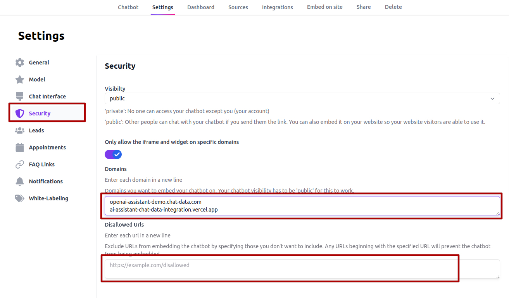
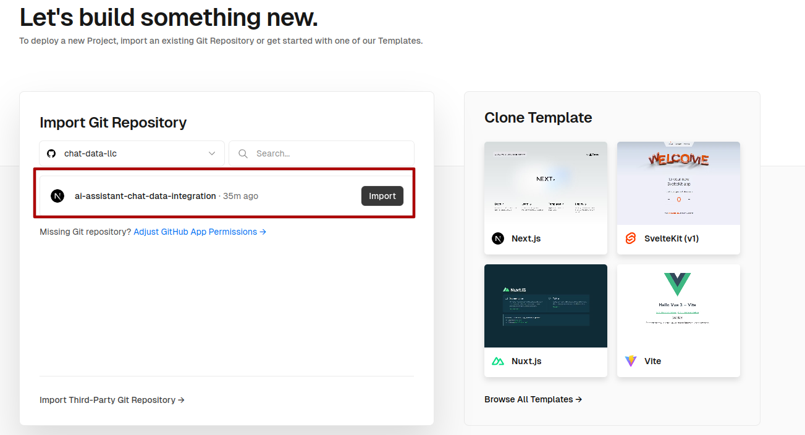

# Integrate OpenAI's Assistant API With Multi-platform With Low Code (Totally Free)

## Introduction
[OpenAI's Assistants API](https://platform.openai.com/docs/assistants/overview?context=with-streaming) empowers developers to create sophisticated AI assistants tailored to their specific application needs. However, once you've developed your assistant, integrating it into various platforms and constructing a frontend infrastructure can be a daunting task. This process includes challenges such as embedding your assistant into websites, and platforms like Slack, Discord, and WhatsApp, not to mention the need for implementing chat history logging, rate limiting, and other protective measures.

To streamline this integration process, our repository presents a low-code solution that enables you to deploy your existing Assistant API across multiple platforms with minimal effort. With this approach, you can achieve integration within just 20 minutes, saving valuable time and resources. This solution is designed to help developers swiftly extend the reach of their AI assistants, making them accessible across the web and popular communication platforms without the hassle of building custom integrations from scratch.

# Demo Page

Experience our solution firsthand at the demo page:

[https://openai-assistant-demo.chat-data.com/](https://openai-assistant-demo.chat-data.com/)

[https://ai-assistant-chat-data-integration.vercel.app/](https://ai-assistant-chat-data-integration.vercel.app/)


# Path

- `src/pages/index.js`:  Demonstrates the seamless integration of a chatbot, powered by your Assistant API, into a web interface. This practical guide showcases how to embed your AI assistant directly on your website, providing a vivid example of real-time interaction capabilities with platforms such as Slack, Discord, and WhatsApp.

- `src/pages/api/chat.js`: Provides the backend framework necessary for creating a custom backend URL, which can be integrated with [Chat Data](https://www.chat-data.com/). This can be done for free under the **Free plan** (No Credit card required), which includes the `Flexible backend to power the chatbot` feature. The primary goal of this repository is to illustrate the integration process in a straightforward manner. For this purpose, we've employed a pre-configured OpenAI Assistant API—specifically, a personal math tutor—following the instructions in this [guide](https://platform.openai.com/docs/assistants/overview?context=with-streaming). It's important to note that the complexity of your Assistant API does not impede the integration process, showcasing the flexibility and adaptability of our solution.


## How to run the script

### 1. Clone the repo

```bash
git clone https://github.com/chat-data-llc/ai-assistant-chat-data-integration.git
```

### 2. Install Dependencies

Open a terminal in the root directory of your local repository and run:

```bash
npm install
```

### 3. Set Up the Environment Variables
In this section, we guide you through the process of setting up the necessary environment variables. These variables enable your application to interact with external services and APIs securely.

- `ASSISTANT_ID`: 
For demonstration purposes, we have utilized the `gpt-3.5-turbo-0125` model to create the assistant. You can create your assistant using the following bash command, as described in [step1](https://platform.openai.com/docs/assistants/overview/step-1-create-an-assistant):

```bash
curl "https://api.openai.com/v1/assistants" \
  -H "Content-Type: application/json" \
  -H "Authorization: $OPENAI_API_KEY" \
  -H "OpenAI-Beta: assistants=v1" \
  -d '{
    "instructions": "You are a personal math tutor. When asked a question, write and run Python code to answer the question.",
    "name": "Math Tutor(Chat Data Demo",
    "tools": [{"type": "code_interpreter"}],
    "model": "gpt-3.5-turbo-0125"
  }'
```
The command's response will include your assistant's ID. Assign this ID to the `ASSISTANT_ID` environment variable. Alternatively, you can create your assistant directly on the OpenAI API[page](https://platform.openai.com/assistants).

- `OPENAI_API_KEY`:

Your OpenAI API key, required for making API requests. You can find your API key [here](https://platform.openai.com/api-keys)

- `BEARER_TOKEN`:

This token is used to authorize external calls to your  `/api/chat` API endpoint. You may set it as a randomly generated string for enhanced security.

- `CHATBOT_ID`:

The unique identifier for the chatbot created on the [Chat Data Create](https://www.chat-data.com/my-chatbots)page. Ensure that `custom-model` is selected as the data source and `https://${your domain}/api/chat`  is set as the `Backend API url`. 

Input the `BEARER_TOKEN` you defined earlier as the Bearer token in this setup. 


You can find your `CHATBOT_ID` in the **Settings** tab after creating your chatbot.


- `WHATSAPP_PHONE_NUMBER`:

Your WhatsApp business phone number, including the country code, is needed for WhatsApp integration. For instance, a test number in the US might look like `15550557603`.

Please specify these environment variables in a `.env` file located in the root directory of the repository. This setup ensures your application can securely access and utilize the APIs and services required for its operation.

### 4.Whitelisting Your Domain

To ensure seamless integration of the chatbot widget on your site, it's essential to whitelist your domain. This step allows the chatbot to operate only within specified areas of your website. For added flexibility, you can specify URL paths that should be excluded from the chatbot's operation in the disallow URL input box. This measure guarantees that the chatbot remains active only on pertinent pages, providing around-the-clock customer support without intrusion.



### 5.Customizing Your Chatbot Interface

Personalize your chatbot by setting up initial greeting messages, suggesting starter questions for users, and customizing the chatbot's icon and name. These adjustments help align the chatbot's appearance and behavior with your brand identity and the chatbot's intended personality.


### 6. Integrating the Chatbot with the website

- **Chat Widget Embedding**: The following script is placed in the `_document.js`  file to embed the chat widget at the bottom right of the page.
```javascript
<Script
  strategy="lazyOnload"
  src={`https://www.chat-data.com/embed.min.js?chatbotId=${process.env.CHATBOT_ID}`}
/>
```
- **Chat Iframe Embedding**: The following script is inserted in the `index.js` file  to embed the chat iframe on the left side of the page.
```javascript
<iframe
  src={`https://www.chat-data.com/chatbot-iframe/${process.env.CHATBOT_ID}`}
  width="100%"
  allow="clipboard-write"
  frameBorder="0"
></iframe>
```

### 7.Integrating Your Chatbot with Discord, Slack, and WhatsApp

This step is optional if you intend to integrate the Assistant API solely with your website. However, for extending the functionality to Slack, Discord, and WhatsApp, follow the detailed guides provided below:

- Slack: [How to Launch Your Custom Slack AI Chatbot Without Writing a Single Line of Code](https://www.chat-data.com/blog/how-to-launch-your-custom-slack-ai-chatbot-without-writing-a-single-line-of-code)

- Discord: [Discord Bot Integration](https://www.chat-data.com/api-reference#section/Chat-Data-Website-Guide/Discord-Bot-Integration)

- Whatsapp: [Whatsapp Integration](https://www.chat-data.com/api-reference#section/Chat-Data-Website-Guide/Whatsapp-Integration)

### 8. Deploy your code.

For production deployment, transfer the code to a Virtual Private Server (VPS) or deploy in [vercel](https://vercel.com/). 

#### VPS deployment

In VPS, Execute the following commands in the root directory of your local repository:

```bash
npm run build & npm run start
```
Using Docker for deployment is recommended when operating on a VPS. 
#### Vercel deployment

- Click import your project:



- Add Environment Variables:


 
- Get your deployed page with domain name:


- Whitelist your Vercel domain:


- Done. You should get something exactly the same as the demo: [https://ai-assistant-chat-data-integration.vercel.app](https://ai-assistant-chat-data-integration.vercel.app)

## Conclusion

The Assistant API offers a robust solution for automating and enhancing various tasks. This repository demonstrates how to unleash the full potential of your Assistant API by deploying it across multiple platforms with minimal coding required. By following these steps, you can significantly expand the accessibility and functionality of your Assistant API, offering a more integrated and efficient user experience.

## Contact

[Chat Data LLC](admin@chat-data.com)
